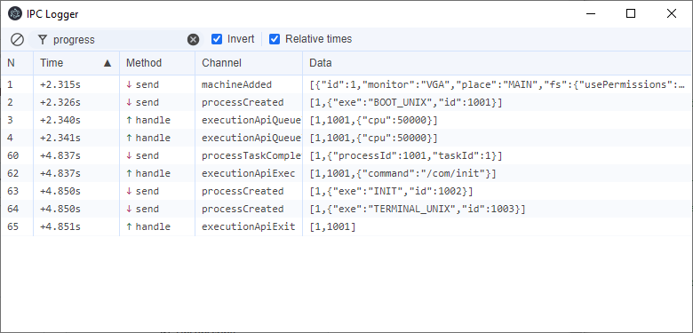

# electron-ipc-logger

Log and display all user-defined IPC traffic in an electron app.



[See the version change log](./CHANGELOG.md).

## Configuring it

```
npm install --save-dev electron-ipc-logger
```

Then, in your main process code just add the following once your app is ready:

```ts
import { installIpcLogger } from 'electron-ipc-logger';

app.whenReady().then(async () => {
  // ...
  await installIpcLogger();
  // ...
});
```

## Options

Complete list of options accepted by `installIpcLogger`:

| Option              | Type                                        | Default               | Notes                                                                                                                                                                                                                                              |
| ------------------- | ------------------------------------------- | --------------------- | -------------------------------------------------------------------------------------------------------------------------------------------------------------------------------------------------------------------------------------------------- |
| `closeIfLastWindow` | `boolean`                                   | `true`                | When another window is closed, if the IPC Logger is opened and it's the only remaining window, it will be automatically closed as well. This is usually the wanted behavior, but can be set to `false` to check data before the application exits. |
| `openUiOnStart`     | `boolean`                                   | `true`                | When `true` the UI window will show as soon as it's ready. If set to `false`, it can be opened at the convenient time by calling `openIpcLoggerWindow`                                                                                             |
| `parent`            | `BrowserWindow`                             | `undefined`           | When provided, the IPC Logger UI Window will be closed when the parent is closed even if other windows are still open. It also will make the IPC Logger UI Window to be displayed on top of the `parent` at every moment.                          |
| `disable`           | `boolean`                                   | `false`               | Allows to quickly enable or disable logging without overriding other options.                                                                                                                                                                      |
| `mainToRenderer`    | `boolean`                                   | `true`                | Log messages sent from the main process to the renderer process.                                                                                                                                                                                   |
| `rendererToMain`    | `boolean`                                   | `true`                | Log messages sent from the renderer process to the main process.                                                                                                                                                                                   |
| `consoleOutput`     | `boolean`                                   | `false`               | Output the intercepted messages to the console (from the main process).                                                                                                                                                                            |
| `logSystemMessages` | `boolean`                                   | `false`               | `true` to include system messages in the log, `false` to exclude them. (Messages prefixed with `ELECTRON` or `CHROME`)                                                                                                                             |
| `shortcut`          | `string` \| `boolean`                       | `'CmdOrCtrl+Shift+D'` | [Accelerator](https://www.electronjs.org/docs/latest/api/accelerator) (key shortcut) to register globally to open the IPC Logger UI window. Can be set to `false` or empty string `''` to disable it (`true` will just keep the default shortcut)  |
| `filter`            | `(data: IpcLogData) => boolean`             | `undefined`           | Allows specifying what IPC messages should be logged or not. Note that unless `logSystemMessages` is set to `true`, the `filter` won't receive data from IPC channels considered as system messages.                                               |
| `onIpcMessage`      | `(channel: string, ...data: any[]) => void` | `undefined`           | Callback to handle the intercepted messages with custom code (i.e. log it to a file, etc.)                                                                                                                                                         |

## F.A.Q

### The IPC Logger UI shows even on production build!

Yes, you are not supposed to _install_ it when building it for production. There are two ways to disable it:

① Manage it manually:

```ts
if (!IS_PRODUCTION) {
  await installIpcLogger();
}
```

② Using the `disable` option for a cleaner code

```ts
await installIpcLogger({ disable: IS_PRODUCTION });
```

### The IPC Logger UI Window stays open when the app closes

Providing a `parent` (i.e. your app main window) enables automatically closing the IPC Logger UI window when your app closes.

```ts
import { installIpcLogger } from 'electron-ipc-logger';

app.whenReady().then(async () => {
  // ...
  await installIpcLogger({ parent: mainWindow });
  // ...
});
```

If your main window is created later (for any reason) and it's not available when installing this module, worry not! You can always provide the parent once your window is available:

```ts
import {
  installIpcLogger,
  setIpcLoggerParentWindow,
} from 'electron-ipc-logger';

app.whenReady().then(async () => {
  // no parent available yet...
  await installIpcLogger();
});

// once it's ready
const mainWindow = createMainWindow();
setIpcLoggerParentWindow(mainWindow);
```

### The IPC Logger UI Window is always shown at the start

Yes, that's how it's set to work by default as the premise is that in development mode (every time the extension is installed), it would be desired to debug IPC messages.

You can however, set it to be hidden by default and open/close it on a better timing (i.e. with some custom button or [app menu](https://www.electronjs.org/docs/latest/api/menu)):

```ts
import { installIpcLogger, openIpcLoggerWindow } from 'electron-ipc-logger';

app.whenReady().then(async () => {
  // no parent available yet...
  await installIpcLogger({ openUiOnStart: false });
});

// To open the UI, you can call this function from an IPC listener or a menu in your app (note that IPC channels need to be handled manually):
ipcMain.handle('YOUR_OPEN_UI_LOGGER_IPC_CHANNEL', () => openIpcLoggerWindow());
```

See ["I closed the IPC Logger UI window. How to open it again?"](#i-closed-the-ipc-logger-ui-window-how-to-open-it-again) for more details.

### I closed the IPC Logger UI window. How to open it again?

There are at least three ways to do it. From the easiest one:

#### ① Accelerators

The easiest one is to rely on [accelerators](https://www.electronjs.org/docs/latest/api/accelerator) (see the `shortcut` option when calling `installIpcLogger()`).

```ts
import { installIpcLogger } from 'electron-ipc-logger';

app.whenReady().then(async () => {
  await installIpcLogger({
    // there's no need to add this option as it's the default one,
    // but this shows how to change the default shortcut to a custom one
    shortcut: 'CommandOrControl+Shift+L',
  });
});
```

By default the IPC Logger UI window can be opened anytime using `Control + Shift + D` (`⌘ + Shift + D` on Mac). The shortcut can be customized or disabled.

#### ② Menu

Set up a [Menu](https://www.electronjs.org/docs/latest/api/menu#class-menu) with an item to open the IPC Logger, that will call `openIpcLoggerWindow()` from the main process.

```ts
import { app, Menu } from 'electron';
import { openIpcLoggerWindow } from 'electron-ipc-logger';

function createDebugMenu(): void {
  // other options might be desired in the template :)
  const template = [
    {
      label: 'Debug',
      submenu: [
        {
          label: 'Open IPC Logger',
          click: openIpcLoggerWindow,
        },
      ],
    },
  ];

  const menu = Menu.buildFromTemplate(template);
  Menu.setApplicationMenu(menu);
}

app.whenReady().then(async () => {
  createDebugMenu();
  // Note that if the windows are created with `autoHideMenuBar: true,` ALT
  // needs to be pressed for the menu to be shown
});
```

#### ③ IPC Messaging

Set up a button, command or custom trigger on your application that sends an IPC message on a custom channel of your choice and then gets processed by the main process to call the said `openIpcLoggerWindow()` function.

```ts
// [on your main process]
import { app } from 'electron';
import { openIpcLoggerWindow } from 'electron-ipc-logger';

ipcMain.handle('openIpcLogger', () => {
  openIpcLoggerWindow();
});
```

```ts
// [on your BrowserWindow]

// asumming you have `<button id="open-ipc-logger">Open IPC Logger</button>` on your HTML
document.getElementById('open-ipc-logger').addEventListener('click', () => {
  // note that ipcRenderer needs to be exposed or the method enabled on your preload script
  window.api.ipcRenderer.invoke('openIpcLogger');
});
```

### How to permantently filter IPC communication?

a.k.a. _I'm using a 3rd party module that uses IPC messages internally, and I don't care about them!_

While it's always possible to filter and search messages in the UI Window, doing that every time might be tiring (specially if there's a lot of _noise_)

Using the `filter` option allows ignoring messages to drop from the log:

```ts
import { installIpcLogger } from 'electron-ipc-logger';

app.whenReady().then(async () => {
  // i.e. let's say we want to ignore messages from i18n-next loading resources,
  // which use the `Readfile-Request` and `Readfile-Response` channels:
  await installIpcLogger({
    filter: ({ channel }) =>
      ![`Readfile-Request`, `Readfile-Response`].includes(channel),
  });
});
```

### Why is this not integrated on dev-tools?

That was actually the initial approach for this module: Providing an extra `IPC` panel in the dev-tools window (the same way [React Developer Tools](https://chromewebstore.google.com/detail/react-developer-tools/fmkadmapgofadopljbjfkapdkoienihi) works)... but the communication between the main process / dev tools window / IPC... was getting too complicated, so I opted to provide a UI Window that works for now, and maybe [continue the dev-tools approach](https://github.com/danikaze/electron-ipc-logger/tree/chrome-extension) at some point in the future.

## How does internally works?

a.k.a. helping [myself](https://github.com/danikaze) remembering the underlying architecture (or explaining the insides to collaborators).

First thing required is to call `installIpcLogger()` from the **main** process.

This will create a UI browser window for the IpcLogger to display the data. Yes, this is always done whether the UI window is shown or not. This is a package for debugging IPC messages so, don't forget to disable it on production (by not calling `installIpcLogger` or by passing the `disabled: true` option).

Once a reference to the window is available, all the relevant IPC methods in `ipcMain` will be _hijacked_, allowing the capture of incoming and outcoming messages, but this alone will not be able capture messages sent when _replying_ incoming events (as it's not done through the `ipcMain` object, but using the `WebContents` of the sender directly).

For that, `BrowserWindow.WebContents` need to be hijacked as well, which is done by getting all the existing windows and listening for the creation of new ones (with the help of the [browser-window-created](https://www.electronjs.org/docs/latest/api/app#event-browser-window-created) event).

The UI window is initialized with the [preload](src/ui/preload.ts) script which exposes some data and the `IpcRenderer`, which will be used to send/receive the captured IPC messages.

IPC messages are captured always in the main process and sent to the UI window using IPCs as well. The installed preload script will store them and make them available for the UI.

For performance reasons, only new messages are sent from the main process to the UI Window. The UI Window keeps a list of the messages to show (limited by `IpcLoggerOptions.logSize`). Messages from the `.invoke` method are _logged twice_: First when calling the method, and then the second time when the result from the call is received, which updates the message from the first step (every message has a unique `id`).

The UI window loads [an empty page](src/ui/index.html) that executes [index.tsx](src/ui/index.tsx) rendering the UI itself via React. This UI registers a listener to _react_ when new data is received from the main process, and from here is just displaying the data as any usual web-app.
